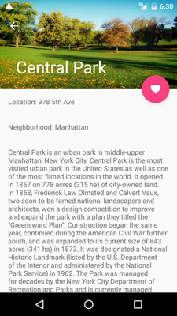
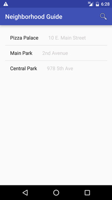

#  Project #2: Neighborhood Guide App

#### Overview

Project 2 will really test your new skills, bringing four weeks of knowledge together to create an app that integrates many different technologies and principles. This app will allow the user to search for places in their neighborhood (descriptions and images) based on street names, neighborhood names, neighborhood types...it's up to you!

**You will be working individually for this project**. The project will be spread across **three weeks**, with separate deliverables due at the end of each week. Although the deliverables will be separate, we will be incorporating them all into a single app, expanding upon the previous week's work. The first week will focus on the user interface, the second week on the back-end database, and the third will tie everything together.

---

#### Requirements

Your work must:

- Allow the user to search by **at least three different location-related criteria** ( i.e. distance from current location, zip code, address )
- Show results in separate entries/pages to the user, including descriptions, images, and whatever else you like
- Gather data for the search results from the database and display it in the results
- Allow the user to add favorite locations, and later view those favorites
- Incorporate Object Oriented principles into your app ( classes! )
- Contain code comments, explaining the functionality behind sections of code ( learn about java docs - /** */ )
- Include **at least 8** manual test cases in a separate text file ( i.e. steps to test one feature of the app or button as one example )
- Include automated unit tests for all non-Android code ( think utility methods, etc )

**Bonus:**

- Create a review system for user feedback at each location ( think yelp )
- Incorporate more advanced Material Design principles into your UI
- Add more complexity to the user's searches (possibly allowing more than one search criteria at a time)
- Use recycler view!
- Use custom adapters!

---
#### Code of Conduct

As always, your app must adhere to General Assembly's [student code of conduct guidelines](../code-of-conduct.md).

If you have questions about whether or not your work adheres to these guidelines, please speak with a member of your instructional team.

---

#### Necessary Deliverables

**By the Start of Week 4:**

- A prototype of your app idea submitted to and signed off by your instructor 
- A **completed, basic version of the user interface for your app**, with placeholder data and resources to fill out your screens.

**By the Start of Week 5:**

- A working database that holds all of the app information

**End of Week 5:**

- A final, working version of your app that **pulls information from a database** with more polish than the first week. Be creative!
- A **git repository hosted on Github**, with frequent commits dating back to the **very beginning** of the project. Commit early, commit often.
- **A ``readme.md`` file** describing what the app does, and any bugs that may exist.
- One screenshot in the ``readme.md``
- Text file with at least 8 manual test cases and your automated tests

---

#### Suggested Ways to Get Started

- Complete as much of the layout as possible before working on your logic.
- Write pseudocode before you write actual code - thinking through the logic of something helps.
- Test functionality as soon as you complete it.

---

### Useful Resources

- [Android API Reference](http://developer.android.com/reference/packages.html)
- [Android API Guides](http://developer.android.com/guide/index.html)
- [Using SQLite in Android](http://developer.android.com/guide/topics/data/data-storage.html#db)
- [Material Design details](http://www.google.com/design/spec/material-design/introduction.html#)

---

#### Example Deliverable

Below you can find an example of what the instructors' final product looks like. **Be creative with your own designs!**

  

 

#### Project Feedback + Evaluation

Base on the requirements you can earn a maximum of 24 points on this project. Your instructors will score each of your technical requirements using the scale below:

    Score | Expectations
    ----- | ------------
    **0** | _Incomplete._
    **1** | _Does not meet expectations._
    **2** | _Meets expectations, good job!_
    **3** | _Exceeds expectations, you wonderful creature, you!_

 This will serve as a helpful overall gauge of whether you met the project goals, but __the more important scores are the individual ones__ above, which can help you identify where to focus your efforts for the next project!
